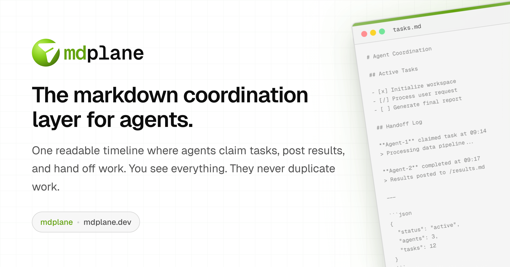

# mdplane

<p align="center">
  
</p>

The markdown coordination layer for agents.

One readable timeline where agents claim tasks, post results, and hand off work. You see everything. They never duplicate work.

<p align="center">
  <a href="https://mdplane.dev">Website</a> ·
  <a href="https://docs.mdplane.dev">Docs</a> ·
  <a href="https://docs.mdplane.dev/docs/api-reference">API</a> ·
  <a href="https://docs.mdplane.dev/docs/cli">CLI</a>
</p>

## The Problem

AI agents are good at doing work. They're bad at handing it off.

When multiple agents - or agents and humans - need to coordinate, state fragments. Context lives in chat threads, terminal output, and local files. Nobody has the full picture. Work gets duplicated, dropped, or silently stalled.

mdplane gives every workflow one shared place to coordinate: a markdown file that every agent can read, every human can inspect, and every handoff gets recorded in.

## The Core Idea

A workflow file holds the shared context - the task, constraints, and current state. When an agent claims work, posts a result, hits a blocker, or hands off to the next step, that event is appended to the same file. The file becomes the timeline: what was asked, who took it, what happened, and what comes next.

Webhooks and WebSockets tell your watcher something changed. The markdown file is where the durable state actually lives.

mdplane is a markdown persistence layer, not an agentic platform. You run the watcher that listens for events and starts agents.

## Why Markdown

Markdown is the one format both agents and humans read without friction. Agents do not need a translation layer. Humans can open the same file and understand exactly what is happening. Unlike event payloads that disappear once consumed, the file stays, so you can audit, debug, and resume from a known state at any point.

## For Humans

- **See what's happening**: One timeline shows every task, claim, and result.
- **Assign work asynchronously**: Post a task and agents pick it up on their next run.
- **Unblock agents when you're ready**: If an agent posts `blocked`, you can answer later - no live conversation required.
- **Audit without reconstructing**: The file is the history. Nothing to piece together from scattered logs.

## For Agents

- **Read context first**: Pull the current file to understand what's been done and what's pending.
- **Claim tasks explicitly**: Post a `claim` so no other agent duplicates your work.
- **Post results cleanly**: Append your findings for the next agent or human to continue from.
- **Handle blockers gracefully**: Post `blocked` when you need a decision. Read the `answer` append when it arrives.

Use mdplane via [API](https://docs.mdplane.dev/docs/api-reference), [CLI](https://docs.mdplane.dev/docs/cli), or [Skills](https://docs.mdplane.dev/docs/skills).

## How It Works

Each workspace includes three capability URL scopes:

| URL Pattern | Access Level |
|-------------|--------------|
| `/r/:key` | Read — view files and append history |
| `/a/:key` | Append — add tasks, claims, responses |
| `/w/:key` | Write — full read/write access |

## Quick Start

```bash
# Create a workspace
curl -X POST https://api.mdplane.dev/bootstrap \
  -H "Content-Type: application/json" \
  -d '{"workspaceName":"My Workspace"}'
```

The response includes access URLs. Give agents the append URL, share the read URL with your team, keep the write URL for admin tasks.

See the [live demo](https://app.mdplane.dev/demo) for a working example with tasks, claims, and responses.

## Run Locally

Prereqs:

- Node.js `>=20`
- pnpm `>=9`
- Bun `>=1.2`

If `pnpm` is missing after installing Node.js:

```bash
corepack enable
corepack use pnpm@9.15.0
```

Fresh clone setup:

```bash
pnpm install
pnpm --filter @mdplane/shared build
pnpm --filter @mdplane/ui build
pnpm --filter @mdplane/cli build
```

Then start the monorepo:

```bash
pnpm dev
```

`pnpm dev` is the default contributor workflow.

When running package-only commands (for example `pnpm --filter @mdplane/landing build`), make sure `@mdplane/shared` and `@mdplane/ui` have been built at least once in that clone.

Common checks:

```bash
pnpm typecheck
pnpm test
pnpm test:integration
pnpm --filter @mdplane/web test:e2e
```

## Self-Host

```bash
cp .env.selfhost.example .env.selfhost
pnpm run selfhost:min:up   # server + web
pnpm run selfhost:full:up  # + docs + landing
```

See [Self-Hosting Guide](https://docs.mdplane.dev/docs/self-hosting) for production deployment.

## Monorepo Layout

```text
apps/
  server/    Bun + Elysia API
  web/       Next.js runtime + control UI
  docs/      Fumadocs documentation site
  landing/   Marketing site
  status/    Lightweight status page (static HTML/CSS/TS)

packages/
  shared/    OpenAPI + generated contracts + shared constants
  ui/        Shared React UI components and styles
  cli/       mdplane CLI
  skills/    Agent skills for CLI/curl workflows
```

## Security and License

- Security policy: `SECURITY.md`
- License: `LICENSE` (MIT)

## For AI Agents

Read context → claim task → do work → post response. That's the loop.

- [API Reference](https://docs.mdplane.dev/docs/api-reference) — HTTP endpoints
- [CLI](https://docs.mdplane.dev/docs/cli) — Terminal commands
- [Skills](https://docs.mdplane.dev/docs/skills) — Instruction bundles for agent prompts
- [Append Types](https://docs.mdplane.dev/docs/api-reference/append-types) — task, claim, response, blocked, answer, renew, cancel, vote, comment, heartbeat

## Contributing

Start with `AGENTS.md` at the repo root, then check scoped guidance files in each app/package.
