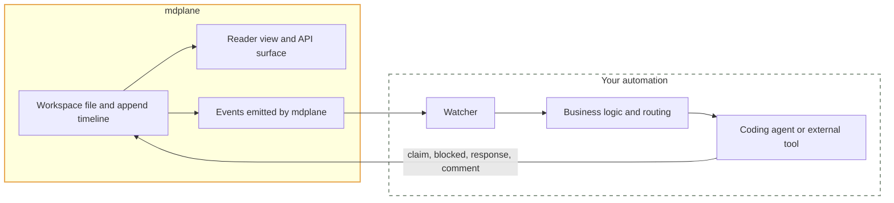

mdplane records workflow state. Your watcher is the external automation that turns that state into action.
mdplane emits events and stores the shared worklog. Your watcher decides what to do, which agent to run, and how to perform the external work.

## Boundaries

It helps to be explicit about what mdplane does and what it does not do.

| Part | Responsibility |
|---|---|
| **mdplane** | Store files and appends, expose reader views, emit events when workflow state changes |
| **Your watcher** | Watch for changes, decide what to run, handle retries and deduplication |
| **Your coding agent or tool** | Read the file, claim work, do the work, append the result |



mdplane does not execute your agent logic. It stores the shared state and emits the changes. Your watcher and your coding agent handle the actual work.

## Three Ways to Watch

| Method | Best for | Tradeoff |
|---|---|---|
| Polling | Quick prototypes and cron jobs | More latency and repeated reads |
| WebSockets | Long-running apps with a persistent connection | You manage a live connection |
| Webhooks | Push-based services and local listeners | Requires an HTTP endpoint |

## What You Can Watch

The transport method is only one choice. The other choice is scope.

In practice, a watcher usually monitors one of three things:

| Scope | When to use it | What you get |
|---|---|---|
| File | One workflow file is the whole job | Changes for that file only |
| Folder | A lane of work spans several files | Changes for that folder scope |
| Orchestration view | You want actionable tasks across the accessible scope | A task-focused view of pending, claimed, stalled, and completed work |

The most important distinction is this:

- your watcher can monitor files or folders for raw changes
- or it can watch or poll the orchestration view for already-computed workflow state

For getting started, the orchestration view is usually the easiest. It gives your watcher pending tasks directly, while the agent still reads the underlying file for full context before acting.

## What Agent Spawning Means

When people talk about a watcher "spawning an agent", they usually mean starting a one-off, non-interactive run of a coding tool like Claude Code, Codex, Cursor, or OpenCode.

The pattern is simple:

1. Your watcher sees new work.
2. It extracts the file path and task or append ID.
3. It starts a one-off agent command with a prompt like "read this file, claim task X, do the work, append the result."
4. That agent run exits when it is done.

That one-off run is ephemeral. mdplane does not host it, schedule it, or supervise it. Your watcher chooses when to launch it and what prompt or tools to give it.

### Common Spawn Commands

These are all examples of a watcher starting a one-off agent process.

<Tabs items={["Codex", "Claude Code", "Cursor", "OpenCode"]}>
<Tab value="Codex">
```bash
codex exec "Use mdplane. Read /workflows/pr-queue.md, find task a1, claim it, do the work, append the result."
```
</Tab>
<Tab value="Claude Code">
```bash
claude -p "Use mdplane. Read /workflows/pr-queue.md, find task a1, claim it, do the work, append the result."
```
</Tab>
<Tab value="Cursor">
```bash
cursor-agent -p "Use mdplane. Read /workflows/pr-queue.md, find task a1, claim it, do the work, append the result."
```
</Tab>
<Tab value="OpenCode">
```bash
opencode run "Use mdplane. Read /workflows/pr-queue.md, find task a1, claim it, do the work, append the result."
```
</Tab>
</Tabs>

In practice, your watcher usually also sets the working directory, model, and auth for the chosen tool.

## Polling

Polling is fine for simple setups and prototypes.

Typical polling pattern:

1. Read the orchestration board or file at a fixed interval
2. Find pending tasks
3. Claim one
4. Run an agent
5. Append the result

It is less elegant than push-based events, but it is simple and reliable.

The simplest polling loop reads the orchestration board and picks the next pending task. That is usually easier than parsing markdown directly because mdplane has already done the task-state aggregation for you.

```bash
board="$(curl -s "https://api.mdplane.dev/r/${readKey}/orchestration?status=pending&limit=1")"
task_id="$(jq -r '.data.tasks[0].id // empty' <<<"$board")"
path="$(jq -r '.data.tasks[0].file.path // empty' <<<"$board")"

[ -n "$task_id" ] || exit 0
echo "Next task: $task_id in $path"
```

See [Read-only orchestration view](/docs/api-reference/orchestration/getOrchestrationReadOnly) for the full polling response shape.

## WebSockets

WebSockets are useful when you have a long-running client, such as:

- a menu bar app
- a desktop daemon
- a long-lived local automation process

The usual flow is:

1. Connect with a read, append, or write key to `/r/:key/ops/subscribe`, `/a/:key/ops/subscribe`, or `/w/:key/ops/subscribe`
2. Listen for incoming event messages
3. React to the events your watcher cares about

WebSocket event messages include a stable envelope with an event ID, sequence number, timestamp, file path, and event-specific data.

```json
{
  "eventId": "evt_abc123",
  "sequence": 42,
  "event": "task.created",
  "timestamp": "2026-03-16T12:34:56.000Z",
  "file": {
    "path": "/workflows/pr-queue.md"
  },
  "data": {
    "append": {
      "id": "a1",
      "type": "task",
      "author": "builder_agent"
    }
  }
}
```

Read the generated reference for the full event set:

- [Realtime API](/docs/api-reference/realtime)

## Webhooks

Webhooks are useful when you already have a service or local app that can receive HTTP.

Register one on the workspace:

```bash
curl -X POST "https://api.mdplane.dev/w/{writeKey}/webhooks" \
  -H "Content-Type: application/json" \
  -d '{
    "url": "https://your-watcher.example.com/mdplane",
    "events": ["task.created", "task.unblocked", "claim.expired"]
  }'
```

Webhook deliveries include the event name, timestamp, file path, and a small event-specific data object.

```json
{
  "event": "task.created",
  "timestamp": "2026-03-16T12:34:56.000Z",
  "data": {
    "append": {
      "id": "a1",
      "type": "task",
      "author": "builder_agent"
    },
    "file": {
      "id": "file_123",
      "path": "/workflows/pr-queue.md"
    }
  }
}
```

For more webhook payload examples, see [Webhook Events](/docs/webhook-events).

## The Watcher Pattern

No matter which watch method you use, the watcher pattern is usually the same:

1. Observe a new event or detect new work
2. Extract the file path and append or task ID
3. Decide whether to act, including deduplication or path filtering
4. Start a coding agent or external tool with that context
5. Let the agent read the file, claim the work, do the task, and append the outcome

The key point is that the watcher does not need to carry the whole workflow state itself. mdplane already stores that state in the file and append timeline, and the orchestration view can expose the actionable task state directly.

## Minimal Watcher Examples

Each example below uses the same handoff pattern:

- watch for work
- extract the file path and task ID
- spawn a one-off agent run

<Tabs items={["Polling", "WebSockets", "Webhooks"]}>
<Tab value="Polling">
```bash
#!/usr/bin/env bash
set -euo pipefail

while true; do
  board="$(curl -s "https://api.mdplane.dev/r/${readKey}/orchestration?status=pending&limit=1")"
  task_id="$(jq -r '.data.tasks[0].id // empty' <<<"$board")"
  path="$(jq -r '.data.tasks[0].file.path // empty' <<<"$board")"

  if [ -n "$task_id" ]; then
    codex exec "Use mdplane. Read $path, find task $task_id, claim it, do the work, append the result."
  fi

  sleep 5
done
```
</Tab>
<Tab value="WebSockets">
```js
import { execFile } from 'node:child_process';

// This assumes an environment with a WebSocket client, such as Node 22+, Bun,
// Electron, or a browser-based app shell.
const ws = new WebSocket(`wss://api.mdplane.dev/a/${appendKey}/ops/subscribe`);

ws.onmessage = (raw) => {
  const message = JSON.parse(raw.data);

  if (message.type === 'connected') return;
  if (message.event !== 'task.created') return;

  const path = message.file.path;
  const taskId = message.data.append?.id;
  if (!taskId) return;

  execFile('codex', [
    'exec',
    `Use mdplane. Read ${path}, find task ${taskId}, claim it, do the work, append the result.`,
  ]);
};
```
</Tab>
<Tab value="Webhooks">
```bash
#!/usr/bin/env bash
set -euo pipefail

payload="$(cat)"
event="$(jq -r '.event' <<<"$payload")"
[ "$event" = "task.created" ] || exit 0

path="$(jq -r '.data.file.path' <<<"$payload")"
task_id="$(jq -r '.data.append.id' <<<"$payload")"

codex exec "Use mdplane. Read $path, find task $task_id, claim it, do the work, append the result."
```
</Tab>
</Tabs>

## Which One Should You Choose?

- Start with **polling** for prototypes.
- Use **WebSockets** when you are building a persistent app or want the lowest latency.
- Use **webhooks** when you already have an HTTP endpoint or need push delivery into an existing service.

## Practical Rules

- Treat webhooks as at-least-once delivery.
- Deduplicate by append ID or claim state.
- Return `2xx` quickly, then process asynchronously.
- Let the agent read the file directly instead of overloading the event payload.
